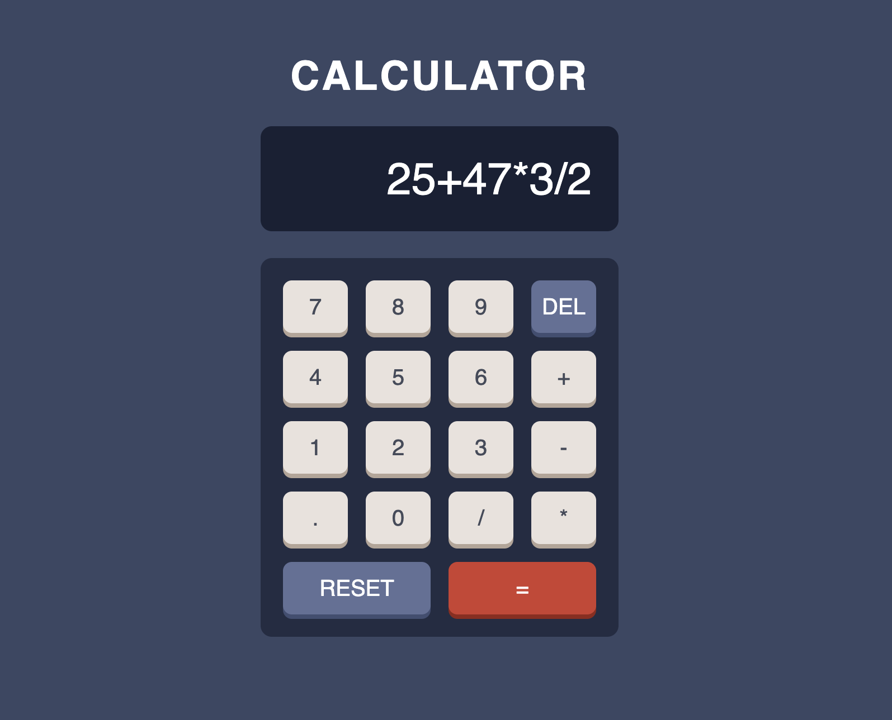
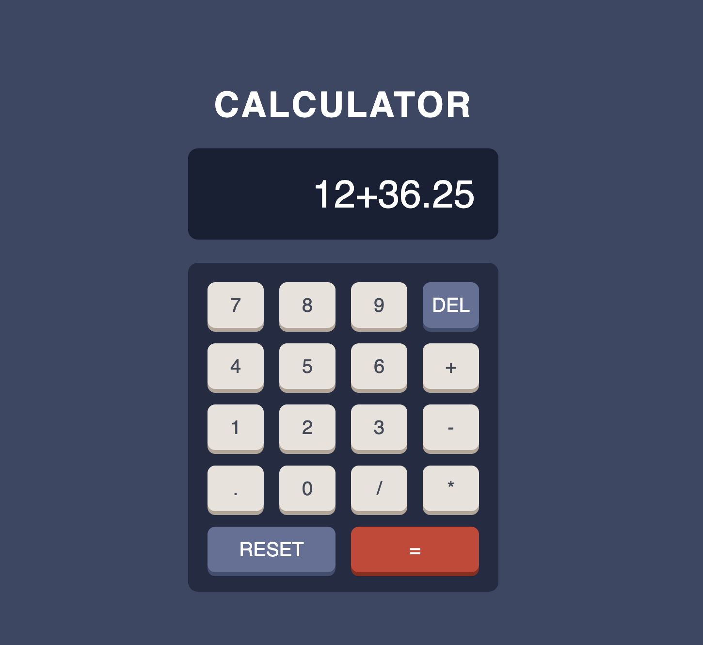

## Calculator App - Overview

A responsive calculator application built as part of a Frontend Mentor challenge. This project focuses on implementing core calculator logic, clean UI structure, and interactive user experience using modern frontend practices.

## Features

- Perform basic arithmetic operations:
- Addition (+)
- Subtraction (−)
- Multiplication (×)
- Division (÷)
- Real-time expression display
- Delete (DEL) functionality for step-by-step correction
- Reset (CLEAR ALL) functionality
- Responsive layout for mobile and desktop
- Keyboard-friendly interaction (optional if implemented)

## Built With

- React.js – UI and state management
- JavaScript (ES6+) – Application logic
- CSS3 / Flexbox / Grid – Layout and styling
- Frontend Mentor – Design inspiration

## Project Structure

src/
├── App.js
├── index.css(styles)
└── index.js(main)

## Functionality Overview

- Expression Handling
- User inputs are stored as a string
- Operators and numbers are appended dynamically
- Evaluation
- Expression is evaluated on = click
- Handles invalid inputs gracefully
- Delete Logic

```js
setExpression((prev) => prev.slice(0, -1));
```

- Reset Logic

```js
setExpression("");
```

## Responsive Design

- Mobile-first approach
- Flexible grid layout for buttons
- Adaptive font sizes and spacing

## Challenges Faced

- Managing edge cases in expression evaluation
- Preventing invalid operator sequences
- Handling floating point precision issues
- Maintaining clean UI alignment across screen sizes

## Future Improvements

- Add keyboard input support
- Improve error handling (e.g., divide by zero)
- Add calculation history
- Implement theme switcher (excluded in current version)

## Live Demo

https://calculator-app-lyart-eight.vercel.app/

## Preview




## Acknowledgements

- Challenge by Frontend Mentor
- Inspired by real-world calculator applications
